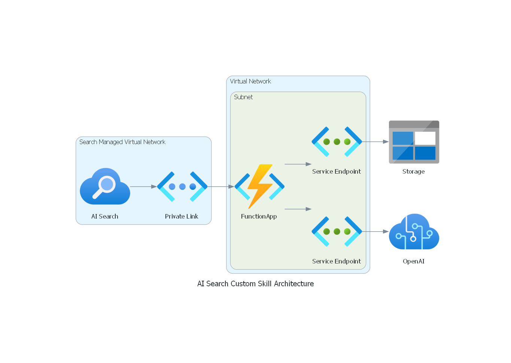
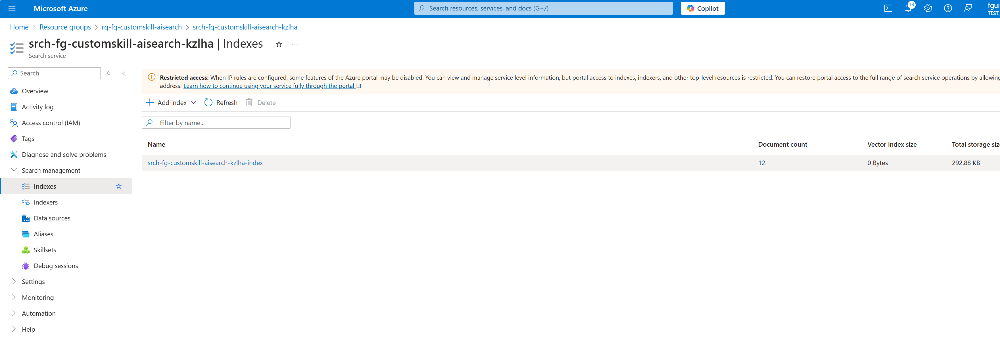
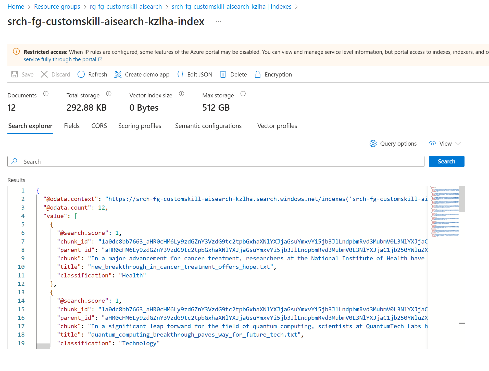
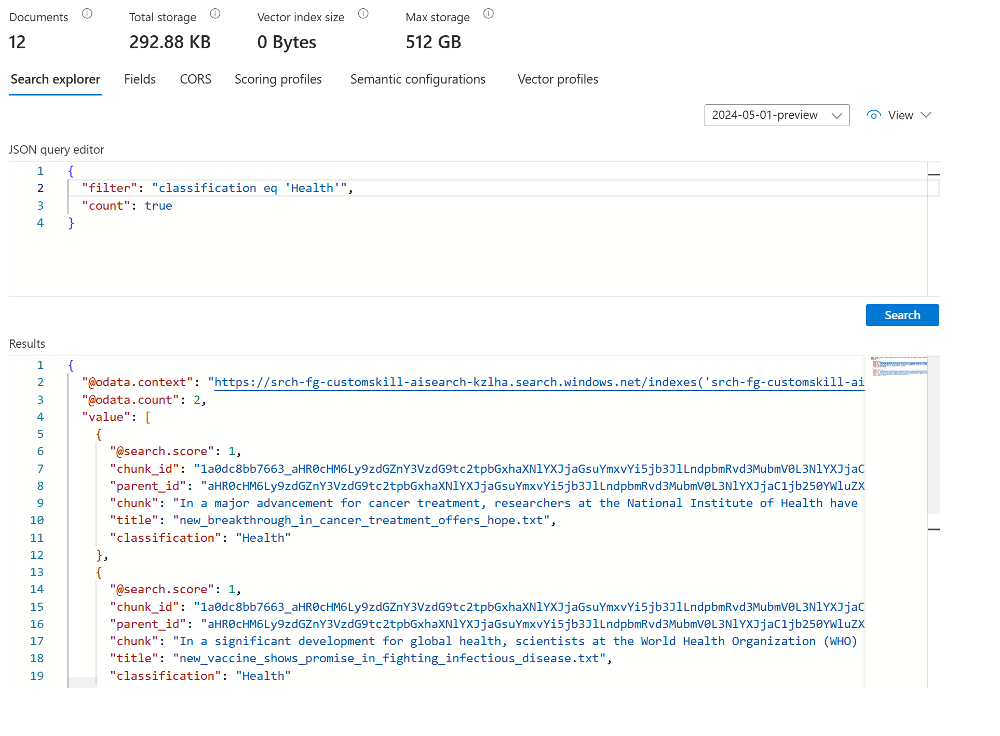

# AI-Search-Skills-in-a-Box

|||
|:---------------------------------------------------------------------------------------------------------------------------------------------------------------------------------------------------------------------------------------------------------------------------------------------------------------------------------| ---:|
| This solution is part of the AI-in-a-Box framework developed by the team of Microsoft Customer Engineers and Architects to accelerate the deployment of AI and ML solutions. Our goal is to simplify the adoption of AI technologies by providing ready-to-use accelerators that ensure quality, efficiency, and rapid deployment.|  |

## User Story
Build a custom indexer pipeline on top of Azure AI Search that enriches your index using OpenAI service

This solution is a great example on how to extend Azure AI Search capabilities by using an Azure Function App to apply custom processing and store it in the index,
making it possible to use the enriched data in your search queries. This ultimately allows you to build a more powerful search engine that can be used in a variety of scenarios.

To demonstrate that, we will leverage a [Custom Web Api Skill](https://learn.microsoft.com/en-us/azure/search/cognitive-search-custom-skill-web-api) that will call an Azure Function App by the time the indexer runs.
The Azure Function App implements a text classifier using OpenAI GPT-4o, which classifies texts into one of the following categories: Politics, Sports, Entertainment, Technology, Business, Health.
In a nutshell, it works by receiving the document content as input, sends it to the OpenAI service, and returns the classification as output.

## What's in the Box


- Deployment templates of all resources needed, which includes:
  - [Azure Function App](https://learn.microsoft.com/en-us/azure/azure-functions/functions-overview)
  - [OpenAI Service and Deployment](https://azure.microsoft.com/en-us/products/ai-services/openai-service)
  - [Azure Storage](https://learn.microsoft.com/en-us/azure/storage/common/storage-introduction)
  - [AI Search](https://learn.microsoft.com/en-us/azure/search/search-what-is-azure-search)
  - [Virtual Network](https://learn.microsoft.com/en-us/azure/virtual-network/virtual-networks-overview)
- Resources are deployed and used with security best practices in mind
  - Azure Storage, AI Search, and OpenAI only supports identity authentication (no keys supported)
  - Azure Storage and OpenAI service can only be accessed through the virtual network service endpoint (no public access)
  - Azure Function App can only be accessed through a private endpoint (no public access)
  - Required RBAC roles are assigned so services can communicate with each other with the least privilege
- Script that uploads files from ./assets/index_files to Azure Storage
  - This will be used by the Azure AI Search indexer
- Python application that sets up Azure AI Search:
  - Setup [data source](https://learn.microsoft.com/en-us/azure/search/search-data-sources-gallery)
  - Setup [skillsets](https://learn.microsoft.com/en-us/azure/search/cognitive-search-working-with-skillsets)
  - Setup [index](https://learn.microsoft.com/en-us/azure/search/search-what-is-an-index)
  - Setup [indexer](https://learn.microsoft.com/en-us/azure/search/search-indexer-overview)
- Python application that runs in Azure Function App:
  - Called by Azure AI Search when the indexer runs
  - Receives a text content as input
  - Sends the input to Azure OpenAI
  - Sends the response to Azure AI Search

## Thinking Outside of the Box
This solution can be adapted for many other use cases. Here are some ideas:

- Update the Azure Function App to perform other actions and return more metadata to be indexed
- Update the skill set to include additional skills
  - You can find the available skills [here](https://learn.microsoft.com/en-us/azure/search/cognitive-search-predefined-skills#azure-ai-resource-skills)
- Integrate with one of the skills available in [azure-search-power-skills](https://github.com/Azure-Samples/azure-search-power-skills) repository
- Integrate vector search and semantic search capabilities

## Deploy the Solution

### Deploy Pre-requisites
1. An [Azure subscription](https://azure.microsoft.com/en-us/free/)
2. Install [Azure CLI](https://docs.microsoft.com/en-us/cli/azure/install-azure-cli-windows?view=azure-cli-latest)
3. Install [Bicep](https://docs.microsoft.com/en-us/azure/azure-resource-manager/bicep/install)
4. Install [Azure Developer CLI](https://learn.microsoft.com/en-us/azure/developer/azure-developer-cli/install-azd)

### Azd Deploy
1. Clone this repository locally

    `git clone https://github.com/Azure-Samples/ai-search-skills-in-a-box/`  

2. Deploy resources

    `az login`

    `azd auth login`

    `azd env new`

    `azd up`

    NOTE: If running this solution in your local environment, it is necessary to set your own IP_ADDRESS, otherwise you will not have permission to upload the files nor use the services.
    
       `azd env set IP_ADDRESS <ip_address>`

You will be prompted for:
- environment name
- azure subscription
- azure region (we suggest using `eastus2`)

### Setup AI Search
This step is required to set up the AI Search service with:
- Data source
- Index
- Skill set
- Indexer

1. Install requirements

    `pip install -r aisearch/requirements.txt`
2. Run the setup script

    `python aisearch/setup.py`

After running the setup script, the indexer will run once. It will scan the uploaded files and apply the pipeline defined in the skill set, which consists of:
- Split skill
  - Breaks down the document into chunks. Necessary so we don't exceed the OpenAI token limit
- Custom Web Api Skill
    - Calls the Azure Function App with each chunk content

The output of the pipeline will be stored in the index.

### Clean up
To remove all resources created by this solution, run:
    
`azd down`

## Run the Solution
After the deployment, the AI Search index is ready to be used. You can query the index using the Azure Search REST API, the Azure Search SDK or the Azure Search Portal.

For simplicity, we will show below how to query it using the Portal:

1. Open the Azure Portal and navigate to the AI Search service you created. Select Search management -> Indexes, and then click on the index you created.

2. Click on the Search button and check that all documents were returned. Investigate the classification field, which is the one that was populated by your Azure Function App logic.

3. Now let's filter documents that contains a specific classification. Click on the View button and select Query view. Then use the json below to filter documents that contains the Health classification. Notice that this time it only returned 2 documents, and both have the Health classification.
    ```json
    {
      "filter": "classification eq 'Health'",
      "count": true
    }
    ```
    

## Customize the Solution

### Return more metadata from the Azure Function App
The Azure Function App can be customized to return more metadata to be indexed. 

In order to do that you'll need to:
1. Update the index schema to include the new fields
   - You need to modify the `aisearch/config/index.json` file. Add the new fields to the `fields` array.
2. Update the Azure Function App to return the new fields
   - You need to modify the `functionapp/functionapp.py` file. Update the `data` dictionary to include the new fields.
      ```json
        'data': {
          'classification': response.choices[0].message.content
        }
      ```
3. Update the skill set to map the new fields (from the Azure Function App response to the index field). For example:
    ```json
      {
        "name": "classification",
        "source": "/document/pages/*/classification",
        "sourceContext": null,
        "inputs": []
      }
    ```
## How to Contribute

This project welcomes contributions and suggestions. Most contributions require you to agree to a Contributor License Agreement (CLA) declaring that you have the right to, and actually do, grant us the rights to use your contribution. For details, visit <https://cla.opensource.microsoft.com>

When you submit a pull request, a CLA bot will automatically determine whether you need to provide a CLA and decorate the PR appropriately (e.g., status check, comment). Simply follow the instructions provided by the bot. You will only need to do this once across all repos using our CLA.

This project has adopted the [Microsoft Open Source Code of Conduct](https://opensource.microsoft.com/codeofconduct/). For more information see the [Code of Conduct FAQ](https://opensource.microsoft.com/codeofconduct/faq) or contact <opencode@microsoft.com> with any additional questions or comments.

## Key Contacts & Contributors

| Contact            | GitHub ID           | Email                    |
|--------------------|---------------------|--------------------------|
| Franklin Guimaraes | @franklinlindemberg | fguimaraes@microsoft.com |

## License

This project may contain trademarks or logos for projects, products, or services. Authorized use of Microsoft trademarks or logos is subject to and must follow [Microsoft's Trademark & Brand Guidelines](https://www.microsoft.com/en-us/legal/intellectualproperty/trademarks/usage/general). Use of Microsoft trademarks or logos in modified versions of this project must not cause confusion or imply Microsoft sponsorship. Any use of third-party trademarks or logos are subject to those third-party's policies.

---

This project is part of the AI-in-a-Box series, aimed at providing the technical community with tools and accelerators to implement AI/ML solutions efficiently and effectively.
